<h1>CARDS</h1>
<table>
<tr><th align="center">small name</th><th align="center">full name</th><th align="center">image</th><th align="center">debug</th></tr>
<tr><th align="center">2C</th><td align="center">TWO OF CLUBS</td><td  align="center"></td><td  align="center"></td></tr>
<tr><th align="center">2D</th><td align="center">TWO OF DIAMONDS</td><td  align="center">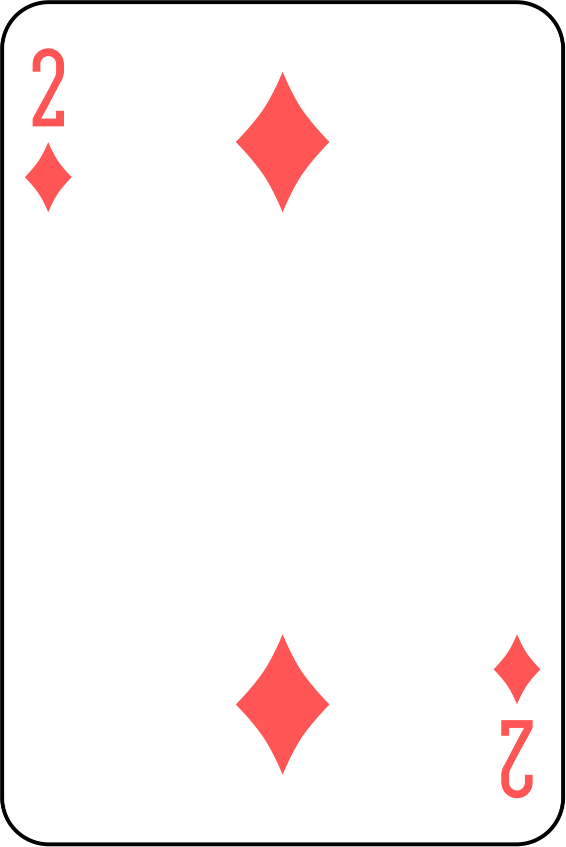</td><td  align="center"></td></tr>
<tr><th align="center">2H</th><td align="center">TWO OF HEARTS</td><td  align="center"></td><td  align="center"></td></tr>
<tr><th align="center">2S</th><td align="center">TWO OF SPADES</td><td  align="center"></td><td  align="center"></td></tr>
<tr><th align="center">3C</th><td align="center">THREE OF CLUBS</td><td  align="center"></td><td  align="center"></td></tr>
<tr><th align="center">3D</th><td align="center">THREE OF DIAMONDS</td><td  align="center"></td><td  align="center"></td></tr>
<tr><th align="center">3H</th><td align="center">THREE OF HEARTS</td><td  align="center">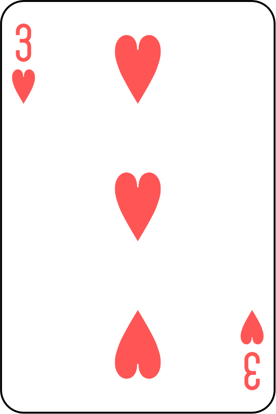</td><td  align="center"></td></tr>
<tr><th align="center">3S</th><td align="center">THREE OF SPADES</td><td  align="center"></td><td  align="center"></td></tr>
<tr><th align="center">4C</th><td align="center">FOUR OF CLUBS</td><td  align="center">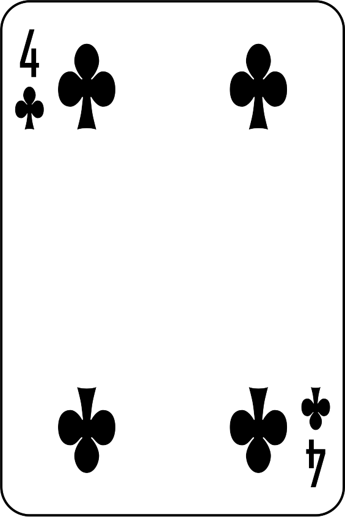</td><td  align="center"></td></tr>
<tr><th align="center">4D</th><td align="center">FOUR OF DIAMONDS</td><td  align="center">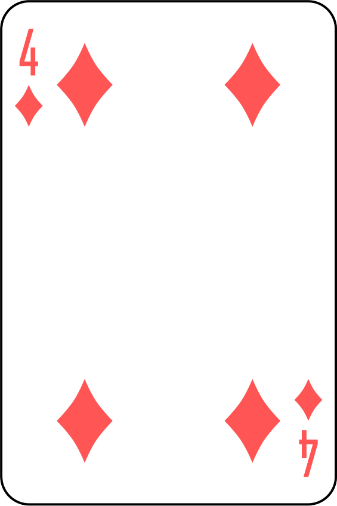</td><td  align="center"></td></tr>
<tr><th align="center">4H</th><td align="center">FOUR OF HEARTS</td><td  align="center"></td><td  align="center"></td></tr>
<tr><th align="center">4S</th><td align="center">FOUR OF SPADES</td><td  align="center">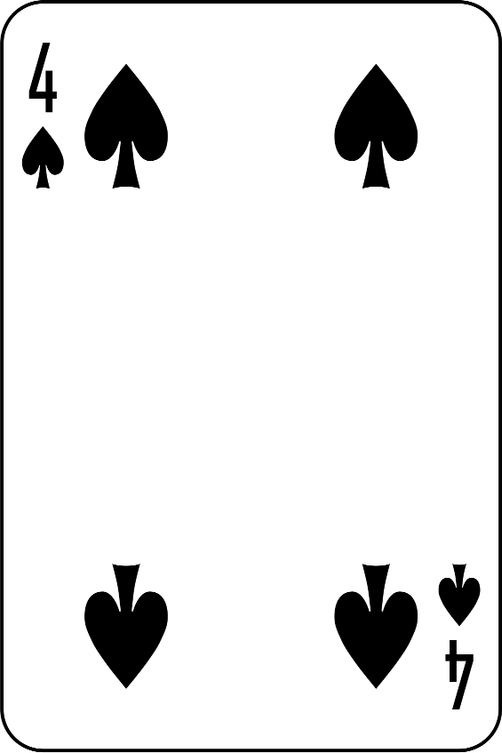</td><td  align="center"></td></tr>
<tr><th align="center">5C</th><td align="center">FIVE OF CLUBS</td><td  align="center"></td><td  align="center"></td></tr>
<tr><th align="center">5D</th><td align="center">FIVE OF DIAMONDS</td><td  align="center">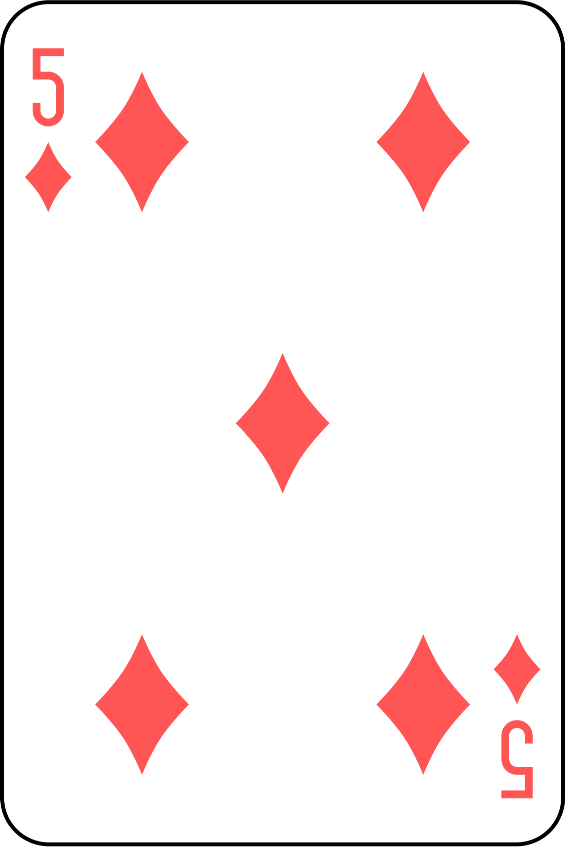</td><td  align="center"></td></tr>
<tr><th align="center">5H</th><td align="center">FIVE OF HEARTS</td><td  align="center"></td><td  align="center"></td></tr>
<tr><th align="center">5S</th><td align="center">FIVE OF SPADES</td><td  align="center"></td><td  align="center"></td></tr>
<tr><th align="center">6C</th><td align="center">SIX OF CLUBS</td><td  align="center">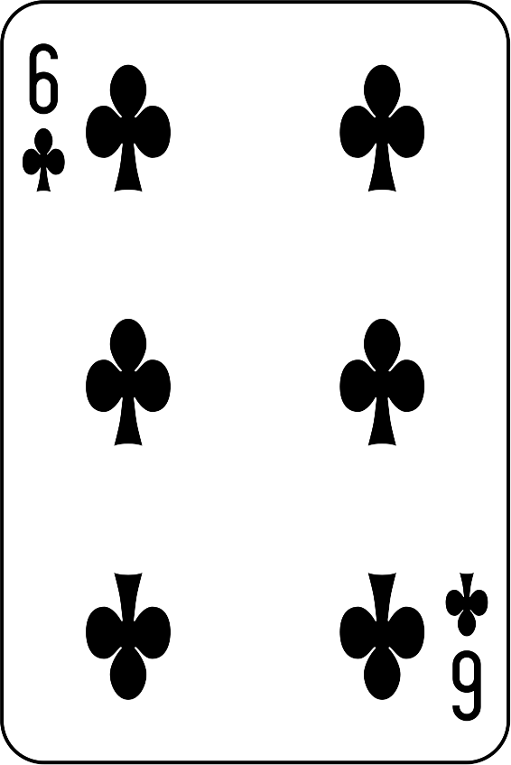</td><td  align="center"></td></tr>
<tr><th align="center">6D</th><td align="center">SIX OF DIAMONDS</td><td  align="center"></td><td  align="center"></td></tr>
<tr><th align="center">6H</th><td align="center">SIX OF HEARTS</td><td  align="center"></td><td  align="center"></td></tr>
<tr><th align="center">6S</th><td align="center">SIX OF SPADES</td><td  align="center"></td><td  align="center"></td></tr>
<tr><th align="center">7C</th><td align="center">SEVEN OF CLUBS</td><td  align="center"></td><td  align="center"></td></tr>
<tr><th align="center">7D</th><td align="center">SEVEN OF DIAMONDS</td><td  align="center">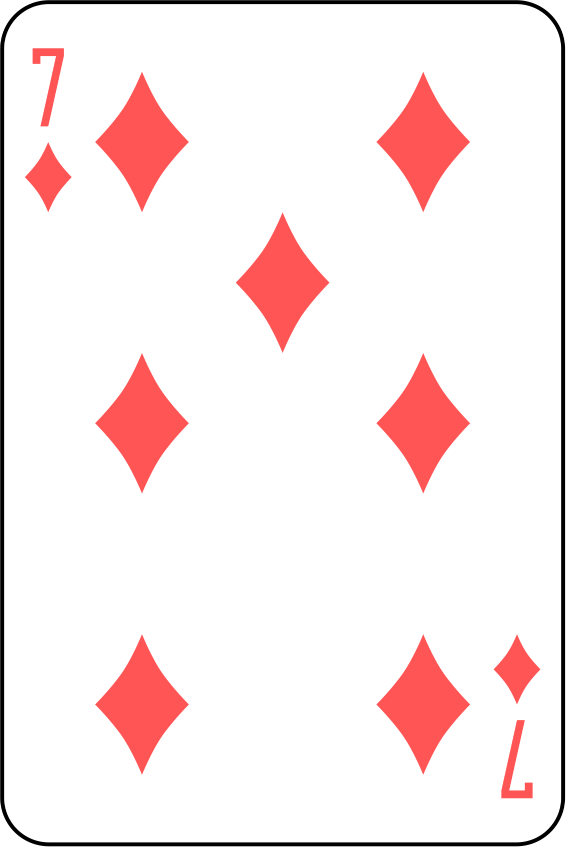</td><td  align="center"></td></tr>
<tr><th align="center">7H</th><td align="center">SEVEN OF HEARTS</td><td  align="center"></td><td  align="center"></td></tr>
<tr><th align="center">7S</th><td align="center">SEVEN OF SPADES</td><td  align="center">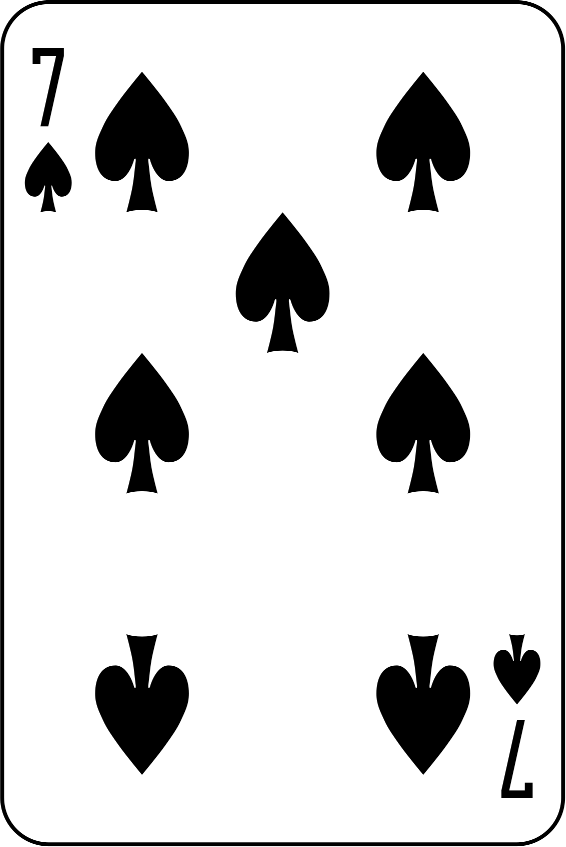</td><td  align="center"></td></tr>
<tr><th align="center">8C</th><td align="center">EIGHT OF CLUBS</td><td  align="center"></td><td  align="center"></td></tr>
<tr><th align="center">8D</th><td align="center">EIGHT OF DIAMONDS</td><td  align="center">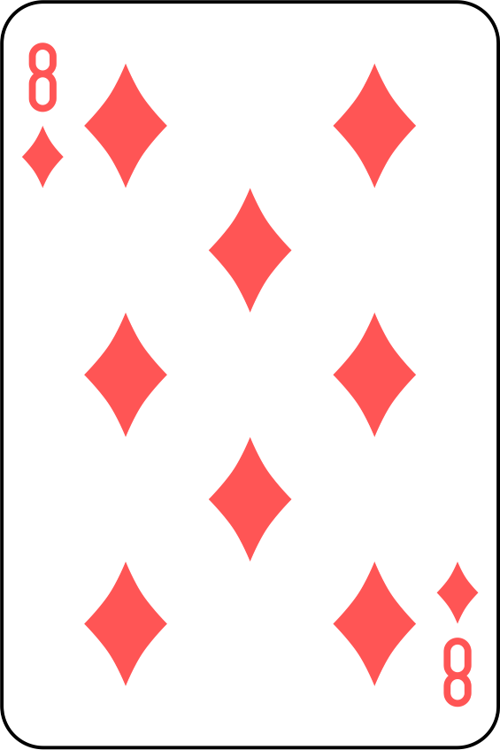</td><td  align="center"></td></tr>
<tr><th align="center">8H</th><td align="center">EIGHT OF HEARTS</td><td  align="center"></td><td  align="center"></td></tr>
<tr><th align="center">8S</th><td align="center">EIGHT OF SPADES</td><td  align="center"></td><td  align="center"></td></tr>
<tr><th align="center">9C</th><td align="center">NINE OF CLUBS</td><td  align="center"></td><td  align="center"></td></tr>
<tr><th align="center">9D</th><td align="center">NINE OF DIAMONDS</td><td  align="center"></td><td  align="center"></td></tr>
<tr><th align="center">9H</th><td align="center">NINE OF HEARTS</td><td  align="center">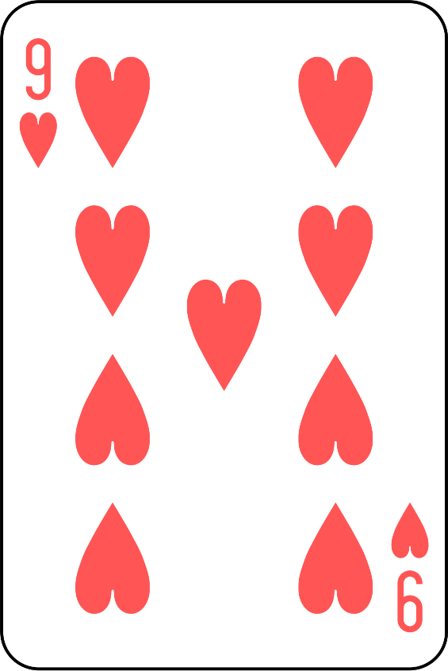</td><td  align="center"></td></tr>
<tr><th align="center">9S</th><td align="center">NINE OF SPADES</td><td  align="center">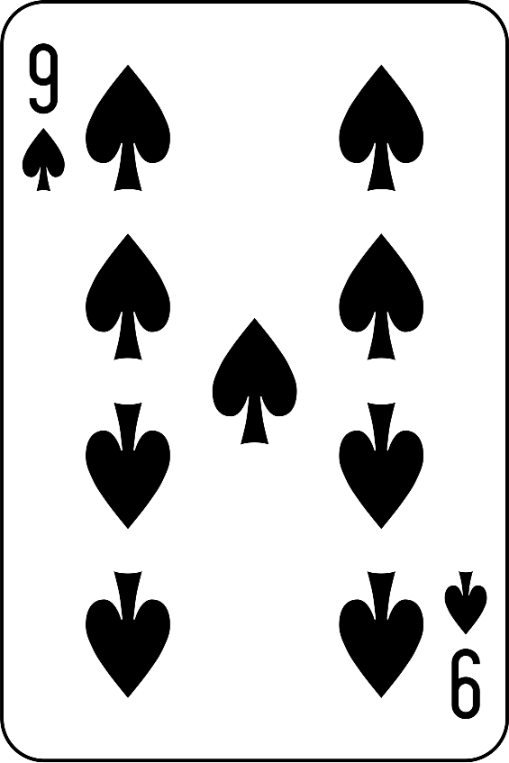</td><td  align="center"></td></tr>
<tr><th align="center">TC</th><td align="center">TEN OF CLUBS</td><td  align="center">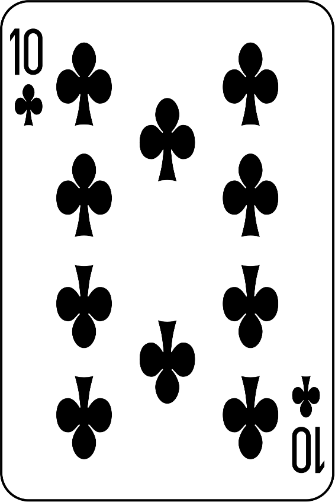</td><td  align="center"></td></tr>
<tr><th align="center">TD</th><td align="center">TEN OF DIAMONDS</td><td  align="center"></td><td  align="center"></td></tr>
<tr><th align="center">TH</th><td align="center">TEN OF HEARTS</td><td  align="center">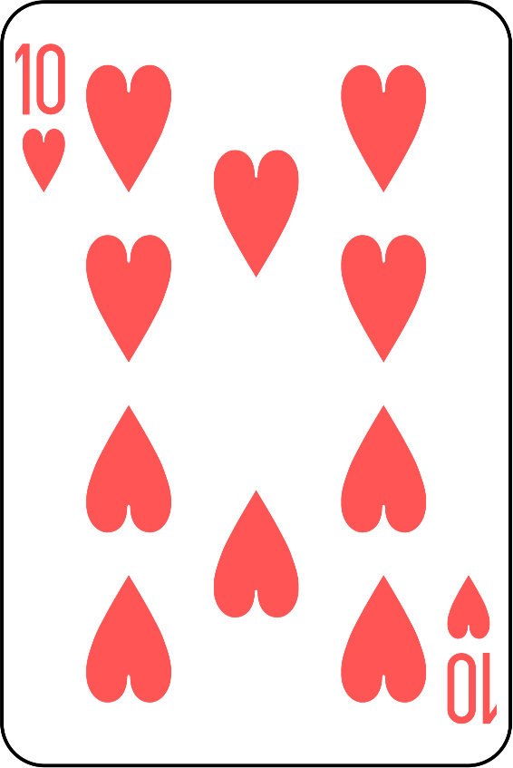</td><td  align="center"></td></tr>
<tr><th align="center">TS</th><td align="center">TEN OF SPADES</td><td  align="center"></td><td  align="center"></td></tr>
<tr><th align="center">JC</th><td align="center">JACK OF CLUBS</td><td  align="center">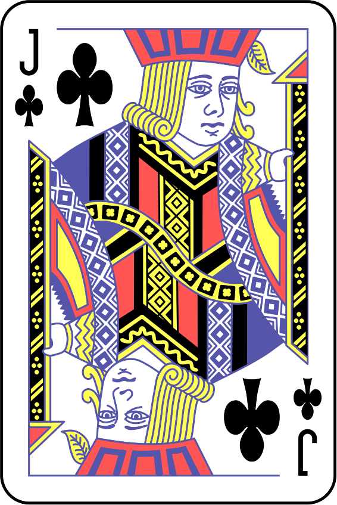</td><td  align="center"></td></tr>
<tr><th align="center">JD</th><td align="center">JACK OF DIAMONDS</td><td  align="center">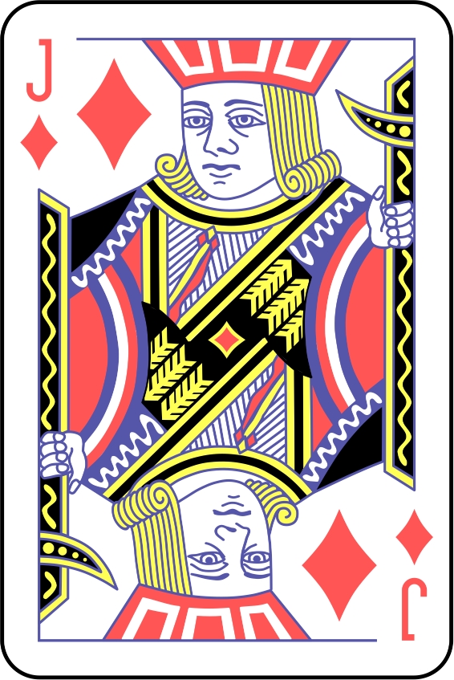</td><td  align="center"></td></tr>
<tr><th align="center">JH</th><td align="center">JACK OF HEARTS</td><td  align="center">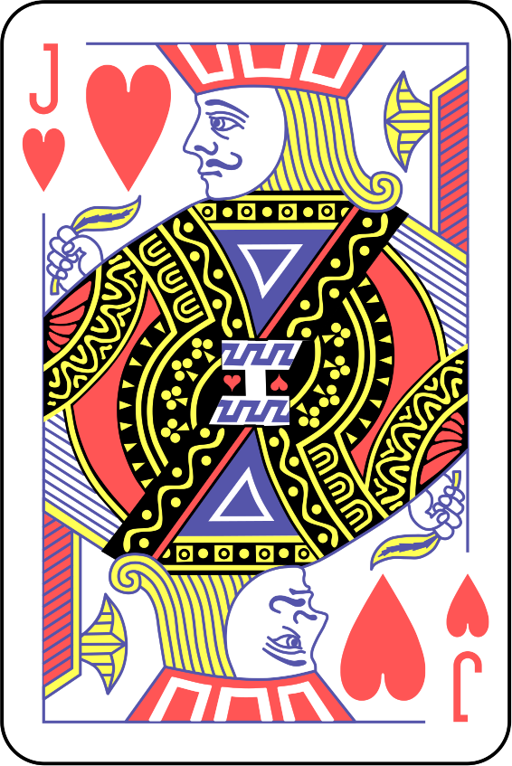</td><td  align="center"></td></tr>
<tr><th align="center">JS</th><td align="center">JACK OF SPADES</td><td  align="center">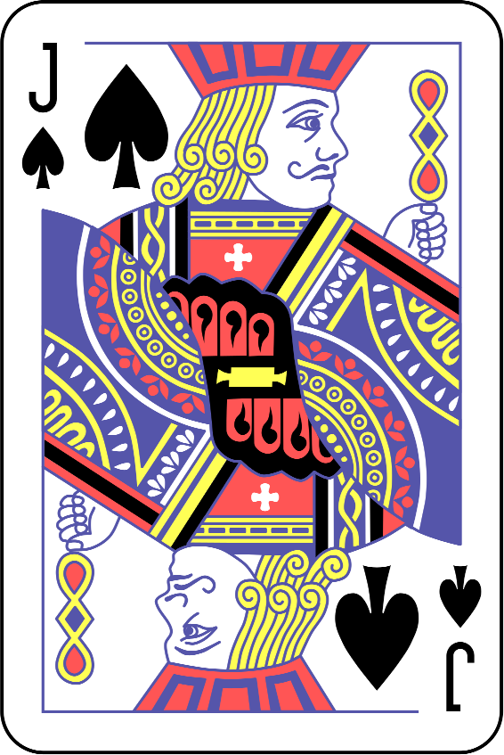</td><td  align="center"></td></tr>
<tr><th align="center">QC</th><td align="center">QUEEN OF CLUBS</td><td  align="center"></td><td  align="center"></td></tr>
<tr><th align="center">QD</th><td align="center">QUEEN OF DIAMONDS</td><td  align="center"></td><td  align="center"></td></tr>
<tr><th align="center">QH</th><td align="center">QUEEN OF HEARTS</td><td  align="center"></td><td  align="center"></td></tr>
<tr><th align="center">QS</th><td align="center">QUEEN OF SPADES</td><td  align="center"></td><td  align="center"></td></tr>
<tr><th align="center">KC</th><td align="center">KING OF CLUBS</td><td  align="center">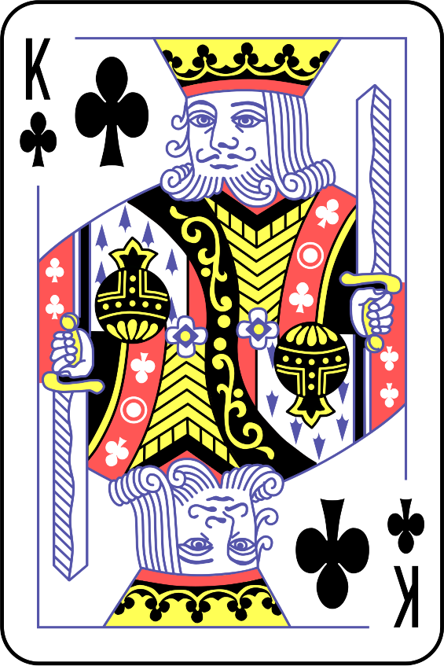</td><td  align="center"></td></tr>
<tr><th align="center">KD</th><td align="center">KING OF DIAMONDS</td><td  align="center"></td><td  align="center"></td></tr>
<tr><th align="center">KH</th><td align="center">KING OF HEARTS</td><td  align="center"></td><td  align="center">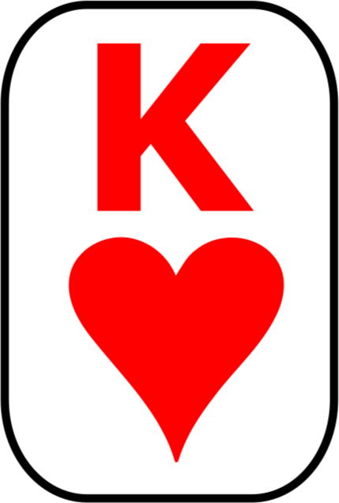</td></tr>
<tr><th align="center">KS</th><td align="center">KING OF SPADES</td><td  align="center"></td><td  align="center"></td></tr>
<tr><th align="center">AC</th><td align="center">ACE OF CLUBS</td><td  align="center"></td><td  align="center"></td></tr>
<tr><th align="center">AD</th><td align="center">ACE OF DIAMONDS</td><td  align="center"></td><td  align="center"></td></tr>
<tr><th align="center">AH</th><td align="center">ACE OF HEARTS</td><td  align="center">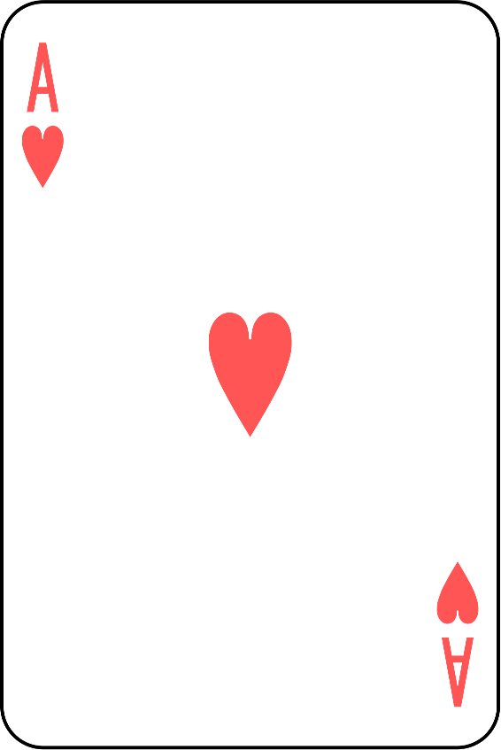</td><td  align="center"></td></tr>
<tr><th align="center">AS</th><td align="center">ACE OF SPADES</td><td  align="center"></td><td  align="center"></td></tr>
</table>
