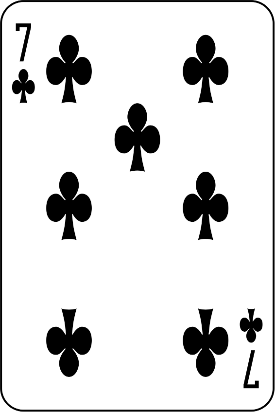
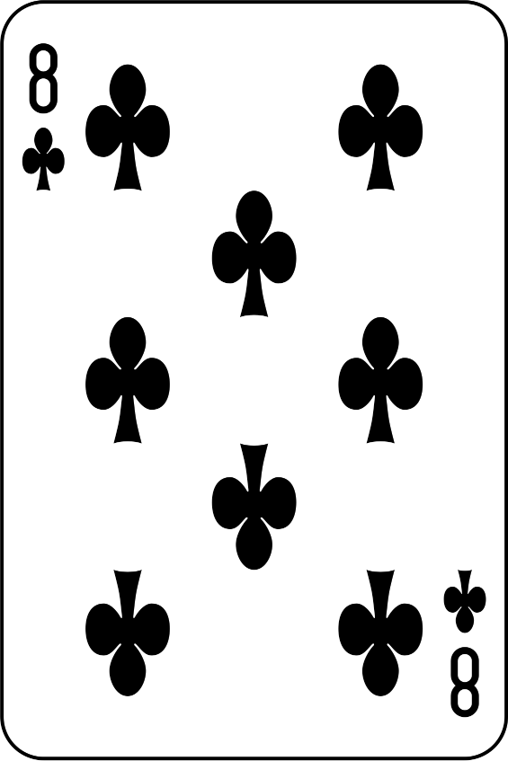

<h1>cards</h1>
<table>
<tr><th>small name</th><th>full name</th><th>image</th></tr>
<tr><th align="center">2C</th><td align="center">two of clubs</td><td  align="center"></td></tr>
<tr><th align="center">2D</th><td align="center">two of diamonds</td><td  align="center"></td></tr>
<tr><th align="center">2H</th><td align="center">two of hearts</td><td  align="center"></td></tr>
<tr><th align="center">2S</th><td align="center">two of spades</td><td  align="center"></td></tr>
<tr><th align="center">3C</th><td align="center">three of clubs</td><td  align="center"></td></tr>
<tr><th align="center">3D</th><td align="center">three of diamonds</td><td  align="center"></td></tr>
<tr><th align="center">3H</th><td align="center">three of hearts</td><td  align="center"></td></tr>
<tr><th align="center">3S</th><td align="center">three of spades</td><td  align="center"></td></tr>
<tr><th align="center">4C</th><td align="center">four of clubs</td><td  align="center"></td></tr>
<tr><th align="center">4D</th><td align="center">four of diamonds</td><td  align="center"></td></tr>
<tr><th align="center">4H</th><td align="center">four of hearts</td><td  align="center"></td></tr>
<tr><th align="center">4S</th><td align="center">four of spades</td><td  align="center"></td></tr>
<tr><th align="center">5C</th><td align="center">five of clubs</td><td  align="center"></td></tr>
<tr><th align="center">5D</th><td align="center">five of diamonds</td><td  align="center"></td></tr>
<tr><th align="center">5H</th><td align="center">five of hearts</td><td  align="center"></td></tr>
<tr><th align="center">5S</th><td align="center">five of spades</td><td  align="center"></td></tr>
<tr><th align="center">6C</th><td align="center">six of clubs</td><td  align="center"></td></tr>
<tr><th align="center">6D</th><td align="center">six of diamonds</td><td  align="center"></td></tr>
<tr><th align="center">6H</th><td align="center">six of hearts</td><td  align="center"></td></tr>
<tr><th align="center">6S</th><td align="center">six of spades</td><td  align="center"></td></tr>
<tr><th align="center">7C</th><td align="center">seven of clubs</td><td  align="center"></td></tr>
<tr><th align="center">7D</th><td align="center">seven of diamonds</td><td  align="center"></td></tr>
<tr><th align="center">7H</th><td align="center">seven of hearts</td><td  align="center"></td></tr>
<tr><th align="center">7S</th><td align="center">seven of spades</td><td  align="center"></td></tr>
<tr><th align="center">8C</th><td align="center">eight of clubs</td><td  align="center"></td></tr>
<tr><th align="center">8D</th><td align="center">eight of diamonds</td><td  align="center"></td></tr>
<tr><th align="center">8H</th><td align="center">eight of hearts</td><td  align="center"></td></tr>
<tr><th align="center">8S</th><td align="center">eight of spades</td><td  align="center"></td></tr>
<tr><th align="center">9C</th><td align="center">nine of clubs</td><td  align="center"></td></tr>
<tr><th align="center">9D</th><td align="center">nine of diamonds</td><td  align="center"></td></tr>
<tr><th align="center">9H</th><td align="center">nine of hearts</td><td  align="center"></td></tr>
<tr><th align="center">9S</th><td align="center">nine of spades</td><td  align="center"></td></tr>
<tr><th align="center">TC</th><td align="center">ten of clubs</td><td  align="center"></td></tr>
<tr><th align="center">TD</th><td align="center">ten of diamonds</td><td  align="center"></td></tr>
<tr><th align="center">TH</th><td align="center">ten of hearts</td><td  align="center"></td></tr>
<tr><th align="center">TS</th><td align="center">ten of spades</td><td  align="center"></td></tr>
<tr><th align="center">JC</th><td align="center">jack of clubs</td><td  align="center"></td></tr>
<tr><th align="center">JD</th><td align="center">jack of diamonds</td><td  align="center"></td></tr>
<tr><th align="center">JH</th><td align="center">jack of hearts</td><td  align="center"></td></tr>
<tr><th align="center">JS</th><td align="center">jack of spades</td><td  align="center"></td></tr>
<tr><th align="center">QC</th><td align="center">queen of clubs</td><td  align="center"></td></tr>
<tr><th align="center">QD</th><td align="center">queen of diamonds</td><td  align="center"></td></tr>
<tr><th align="center">QH</th><td align="center">queen of hearts</td><td  align="center"></td></tr>
<tr><th align="center">QS</th><td align="center">queen of spades</td><td  align="center"></td></tr>
<tr><th align="center">KC</th><td align="center">king of clubs</td><td  align="center"></td></tr>
<tr><th align="center">KD</th><td align="center">king of diamonds</td><td  align="center"></td></tr>
<tr><th align="center">KH</th><td align="center">king of hearts</td><td  align="center"></td></tr>
<tr><th align="center">KS</th><td align="center">king of spades</td><td  align="center"></td></tr>
<tr><th align="center">AC</th><td align="center">ace of clubs</td><td  align="center"></td></tr>
<tr><th align="center">AD</th><td align="center">ace of diamonds</td><td  align="center"></td></tr>
<tr><th align="center">AH</th><td align="center">ace of hearts</td><td  align="center"></td></tr>
<tr><th align="center">AS</th><td align="center">ace of spades</td><td  align="center"></td></tr>
</table>
